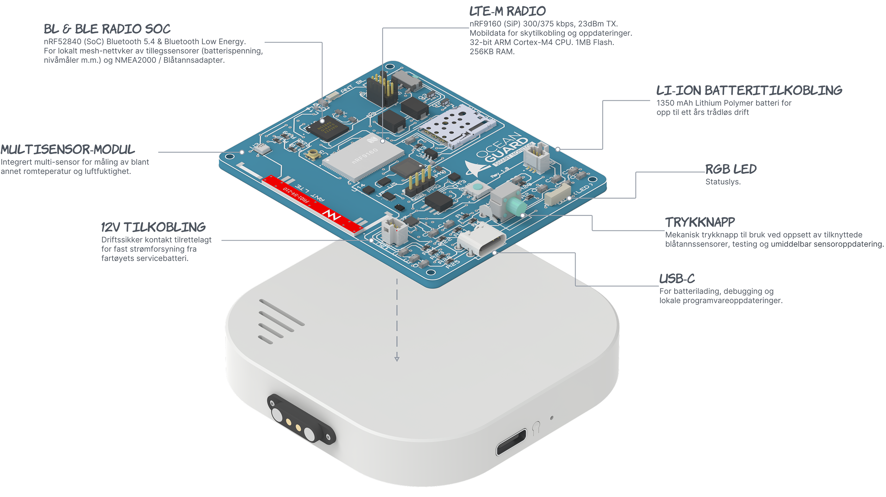
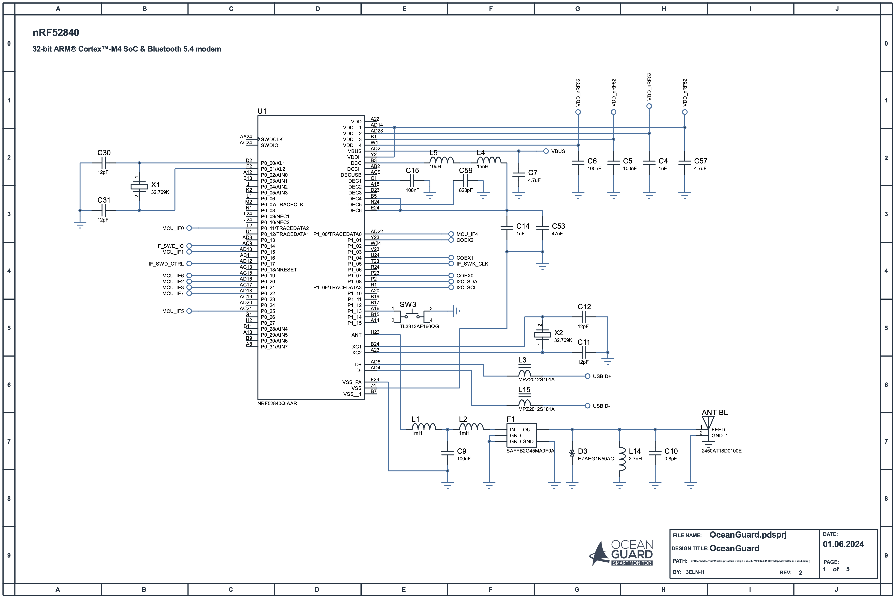
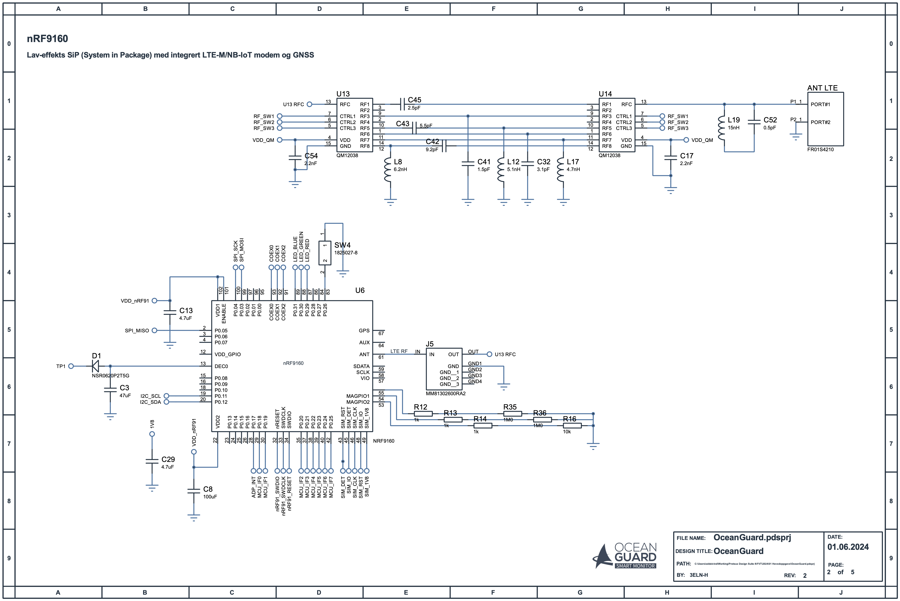
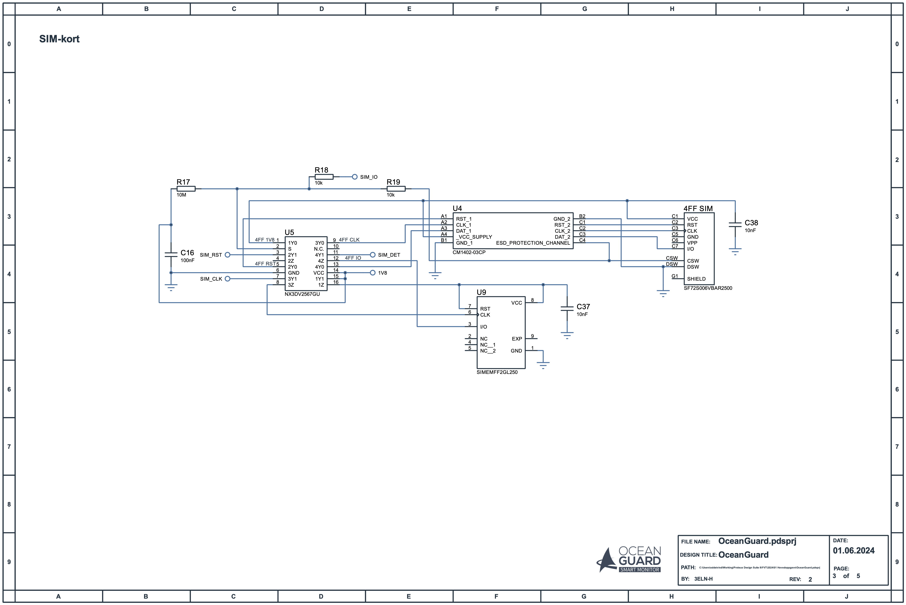
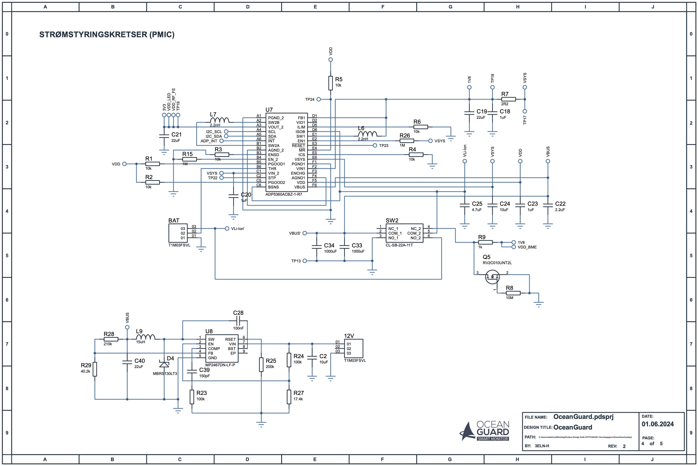
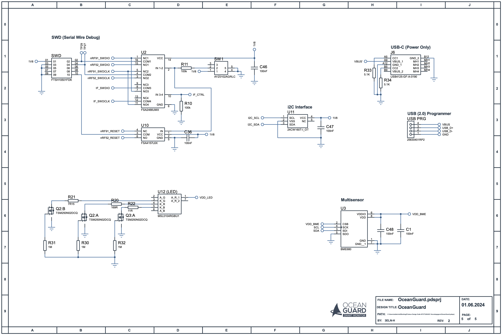
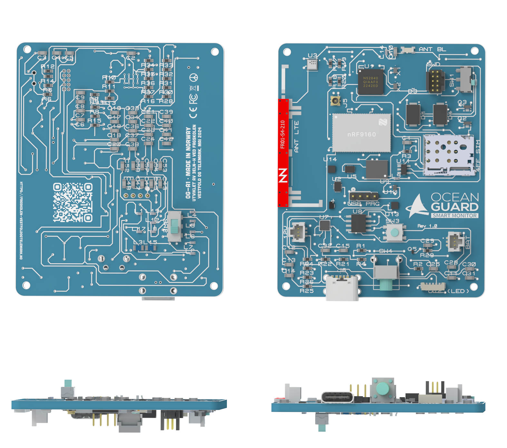
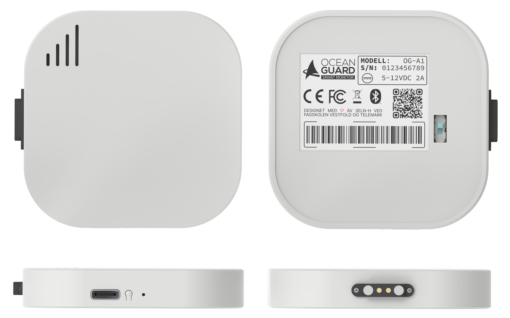

 

  

<!-- <h3 align="center">'<s>ny</s>Norskroboten'</h3> -->

  

    <!-- Retter aktive nettside fra nynorsk til norsk (bokmål), for økt leseglede &#9829;
     
      -->
    <a href="#intro"><strong>Intro</strong></a>
    ·
    <a href="#skjema"><strong>Skjema & Utlegg</strong></a>
    ·
    <a href="#fw"><strong>Modell</strong></a>
    ·
    <a href="#fw"><strong>Firmware</strong></a>
    ·
    <a href="#analyser"><strong>Analyser</strong></a>

  

## OceanGuard
Del av 00E02H Hovedprosjekt for 3ELN-H: LPWAN-BASERTE IOT LØSNINGER FOR MARITIM MONITORERING.

Proof of Concept: OceanGuard - LTE-M og Bluetooth 5 gateway med multisensor for måling av omgivelsestemperatur, realtiv fuktighet, barometrisk trykk og VOC-gasser. PoC benytter Nordic’s nRF Cloud til logging og visualisering av sensordata.

## Skjema & Utlegg
### Kretsskjema

#### ARK 1: Bluetooth Modem

| ID           | Modell          | Beskrivelse                                                | DB  |
| ------------ | --------------- | ---------------------------------------------------------- | --- |
| U1           | nRF52840        | 32-bit ARM Cortex-M4 SoC og Bluetooth 5.4 modem            | [1] |
| SW3          | TL3313          | Trykknapp. Boot (nRF52840)                                 | [2] |
| F1           | SAFFB2G45MA0F0A | SAW Filter for ISM2.4G båndet                              | [3] |
| D3           | EZAEG1N50AC     | ESD beskyttelsesdiode (TSV / Transient Voltage Suppressor) | [4] |
| ANT BL       | 2450AT18D0100   | 2.45 GHz SMD Antenna (Bluetooth)                           | [5] |
| L3, L15      | MPZ2012S101A    | Ferritperler (Chip Beads)                                  | [6] |

[1]: https://www.nordicsemi.com/Products/nRF52840
[2]: https://developer.nordicsemi.com/nRF_Connect_SDK/doc/latest/nrf/device_guides/nrf91/thingy91_updating_fw_programmer.html#updating-the-conn-bridge-52840
[3]: https://www.murata.com/products/productdata/8798248468510/DS-SAFFB2G45MA0F0A.pdf?1700451055000
[4]: https://no.mouser.com/datasheet/2/315/Panasonic_01042017_EZA-1196868.pdf
[5]: https://eu.mouser.com/datasheet/2/611/2450AT18D0100-1519342.pdf
[6]: https://product.tdk.com/en/system/files?file=dam/doc/product/emc/emc/beads/catalog/beads_commercial_power_mpz2012_en.pdf

 

#### ARK 2: LTE-M Modem

| ID       | Modell          | Beskrivelse                                                  | DB  |
| -------- | --------------- | ------------------------------------------------------------ | --- |
| U6       | nRF9160         | Lav-effekts SiP med integrert LTE-M/NB-IoT modem og GNSS     | [7] |
| U13, U14 | QM12038         | SP8T, CDMA, WCDMA og LTE bryter (low loss, high isloation)   | [8] |
| ANT LTE  | FR01-S4-210     | TRIO mXTENDTM (FR01-S4-210) – Antenne for mobil-frekvensbånd | [9] |

[7]: https://www.nordicsemi.com/Products/nRF9160
[8]: https://www.qorvo.com/products/p/QM12038
[9]: https://no.mouser.com/datasheet/2/1029/UM_FR01_S4_210_1-1863540.pdf

 

#### ARK 3: SIM

| ID  | Modell          | Beskrivelse                                   | DB   |
| --- | --------------- | --------------------------------------------- | ---- |
| U4 | CM1402           | SIM-kort EMI Filter array med ESD beskyttelse | [10] |
| U5 | NX3DV2567        | Lav-ohmsk 4-polt double-throw analog bryter   | [11] |
| U9 | SIMEMFF2GL250    | Hologram IoT eUICC MFF2 Global SIM            | [12] |
| J1 | SF72S006VBAR2500 | 4FF nano-SIM-kort konnektor                   | [13] |

[10]: https://www.onsemi.com/pdf/datasheet/cm1402-d.pdf
[11]: https://www.nxp.com/docs/en/data-sheet/NX3DV2567.pdf
[12]: https://support.hologram.io/hc/en-us/articles/8973051250839-Hologram-IoT-SIM-datasheets
[13]: https://eu.mouser.com/datasheet/2/206/JAEI_S_A0000031961_1-2550636.pdf

 

#### ARK 4: PMIC

| ID       | Modell           | Beskrivelse                                                     | DB   |
| -------- | ---------------- | --------------------------------------------------------------- | ---- |
| U4       | ADP5360          | Avansert batteristyrings IC (PMIC) med power buck og buck boost | [14] |
| U8       | MP2467DN-LF-P    | Step-Down omformer 12V til 5V                                   | [15] |

[14]: https://www.analog.com/media/en/technical-documentation/data-sheets/ADP5360.pdf
[15]: https://no.mouser.com/datasheet/2/277/MP2467-2945815.pdf

 

#### ARK 5: Multisensor og Grensesnitt

| ID  | Modell            | Beskrivelse                                                                                                                                    | DB   |
| --- | ----------------- | ---------------------------------------------------------------------------------------------------------------------------------------------- | ---- |
| U11 | 24CW160Tr         | 16K-128K I2C Serial EEPROM med Software Write Protection                                                                                       | [16] |
| U3  | BME680            | Multisensor: Gass sensor som ma ̊ler relativ fuktighet, barometrisk trykk, omgivelsestemperatur og VOC (partikler / Volatile Organic Compounds) | [17] |
| U2  | FSA2466UMX        | DATA/AUDIO Low-Voltage Dual DPDT Analog Switch (del av SWD Debug interface)                                                                    | [18] |
| U10 | FSA4157L6X        | Low-Voltage, 1 SPDT Analog Switch (del av SWD Debug interface)                                                                                 | [19] |
| U12 | MSL0104RGBU1      | RGB LED                                                                                                                                        | [20] |
| J6  | USB4125-GF-A-0190 | USB-C konnektor (power only)                                                                                                                   | [21] |

[16]: https://ww1.microchip.com/downloads/aemDocuments/documents/OTH/ProductDocuments/DataSheets/24CW16X-24CW32X-24CW64X-24CW128X-Data-Sheet-20005772B.pdf
[17]: https://www.bosch-sensortec.com/products/environmental-sensors/gas-sensors/bme680/
[18]: https://www.onsemi.com/pdf/datasheet/fsa2466-d.pdf
[19]: https://www.onsemi.com/pdf/datasheet/fsa4157-d.pdf
[20]: https://fscdn.rohm.com/en/products/databook/datasheet/opto/led/chip_multi/msl0104rgbu1-e.pdf
[21]: https://no.mouser.com/ProductDetail/GCT/USB4125-GF-A-0190?qs=QNEnbhJQKvbCz4hEJBS24w%3D%3D

 

### Kretskortutlegg

## Modell

## Firmware
TBA

## Analyser
TBA

 

(<a href="#readme-top">Tilbake til toppen</a>)
